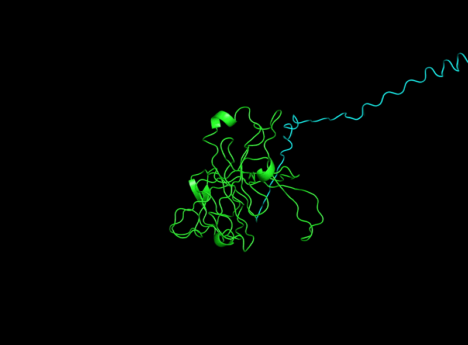

# OpenProtein

A PyTorch framework for tertiary protein structure prediction.




## Getting started

This project uses [uv](https://docs.astral.sh/uv/) to manage its Python environment. After installing `uv`, clone the repository, install dependencies, and run the sample experiment:

```bash
git clone https://github.com/romba050/BioHackathon2020.git
cd BioHackathon2020
uv sync
uv run python __main__.py
```

`uv sync` installs a compatible Python (3.11 or 3.12) if needed and creates a `.venv` with pinned dependencies from `uv.lock`. Use `--hide-ui` to skip the live dashboard server, or `--help` to see all options.

The dashboard server listens on port 5000 by default. On recent macOS versions that port is taken by the AirPlay Receiver, so either disable it in System Settings or pick another port with `OPENPROTEIN_DASHBOARD_PORT=5050 uv run python __main__.py`.

```bash
uv run python __main__.py
```

```
------------------------
--- OpenProtein v0.1 ---
------------------------
Live plot deactivated, see output folder for plot.
Starting pre-processing of raw data...
Preprocessed file for testing.txt already exists.
force_pre_processing_overwrite flag set to True, overwriting old file...
Processing raw data file testing.txt
Wrote output to 81 proteins to data/preprocessed/testing.txt.hdf5
Completed pre-processing.
2018-09-27 19:27:34: Train loss: -781787.696391812
2018-09-27 19:27:35: Loss time: 1.8300042152404785 Grad time: 0.5147676467895508
...
```

## Live dashboard


The screenshot above shows the OpenProtein dashboard, a small React app in the [`dashboard/`](dashboard/) folder. It renders the predicted and actual structure of a validation protein in 3D, plots training progress, and draws a Ramachandran plot of predicted versus actual dihedral angles.

While training runs, this project starts a Flask server (see `dashboard.py`) that exposes the latest evaluation results as JSON at `http://localhost:5000/graph`. The dashboard polls that endpoint every five seconds. To run it you need Node.js:

```bash
cd dashboard
npm install
npm start
```

Then start training from the repository root without `--hide-ui` and open `http://localhost:3000/`. If the training process serves on a different port (see the macOS note above), point the dashboard at it:

```bash
REACT_APP_BACKEND_URL=http://localhost:5050/graph npm start
```

The dashboard was originally published by BioLib as `openprotein-dashboard` under the MIT license and is vendored here because the original repository is no longer online.

## Developing a Predictive Model

See `models.py` for examples of how to create your own model.

To run the linter and tests locally:

```bash
git ls-files '*.py' | xargs uv run pylint --rcfile=.pylintrc
uv run python -m pytest
```

To run pylint on every commit, run `git config core.hooksPath git-hooks`.

## Using a Predictive Model

See `prediction.py` for examples of how to use pre-trained models.

## Memory Usage

OpenProtein includes a preprocessing tool (`preprocessing.py`) which will transform the standard ProteinNet format into a hdf5 file and save it in `data/preprocessed/`. This is done in a memory-efficient way (line-by-line).

The OpenProtein PyTorch data loader is memory optimized too - when reading the hdf5 file it will only load the samples needed for each minibatch into memory.

## Creating Demo image

```bash
# converting demo.mpg -> demo.gif
ffmpeg -i demo.mpg -vf "fps=12,scale=800:-1:flags=lanczos,split[s0][s1];[s0]palettegen[p];[s1][p]paletteuse" demo.gif

# same but slowed down * 8:
ffmpeg -i demo.mpg -vf "setpts=8.0*PTS,fps=12,scale=800:-1:flags=lanczos,split[s0][s1];[s0]palettegen[p];[s1][p]paletteuse" -y demo.gif
```

## License

Please see the LICENSE file in the root directory.
